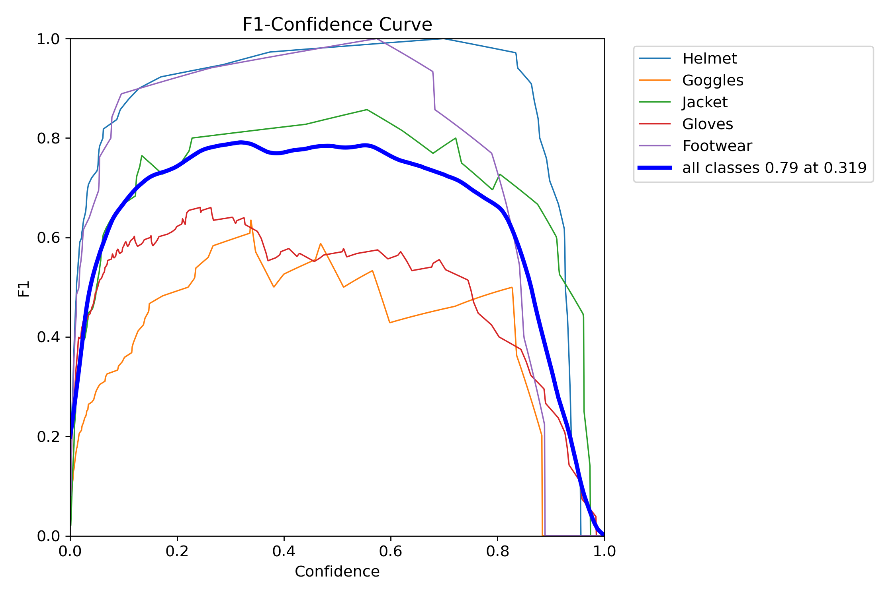
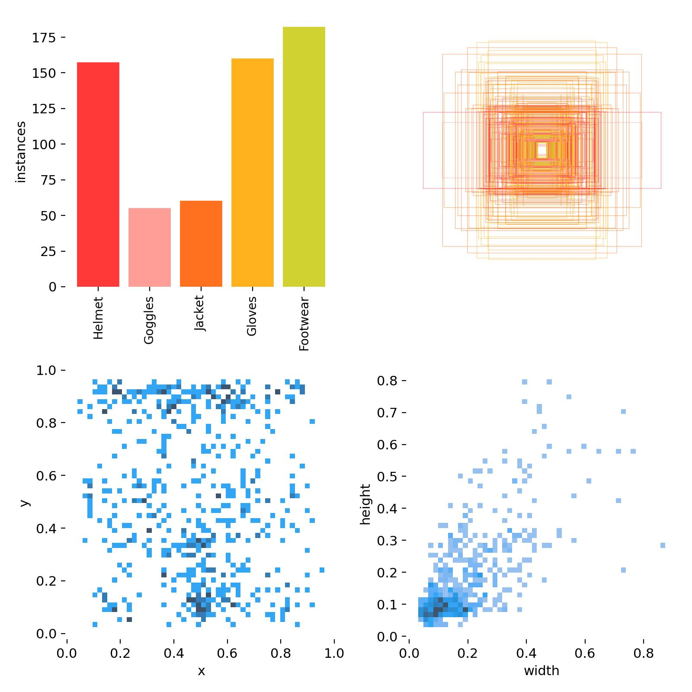
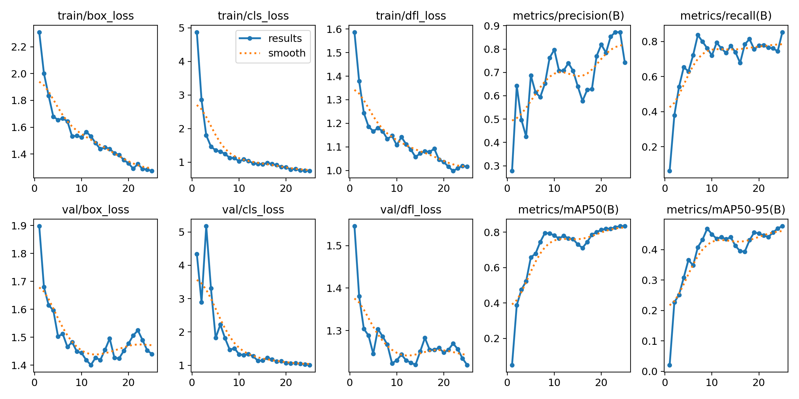
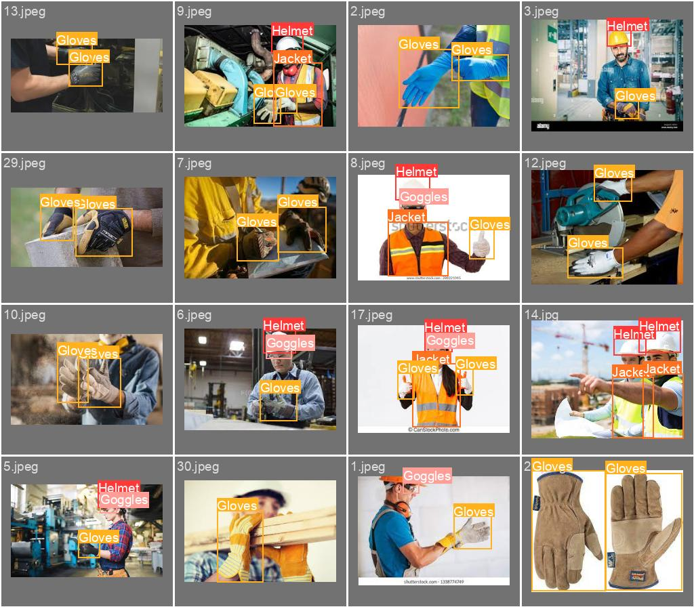
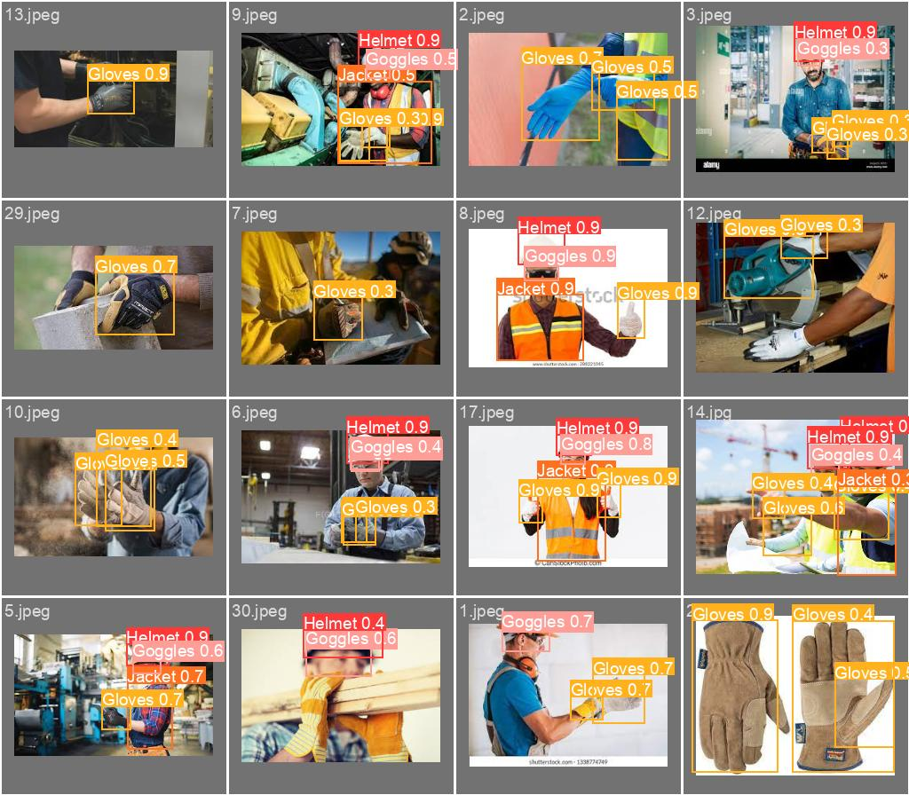
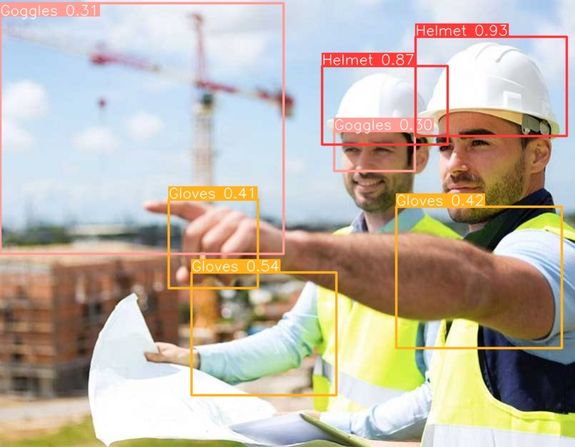

# YOLOv8-Custom-Detection_Amit

This repository contains a custom object detection project using YOLOv8. In this project, I focused on detecting five specific objects/classes: Helmet, Goggles, Jacket, Gloves, and Footwear.

## Project Overview

- **Dataset**: Custom dataset containing images with annotations for the following classes:
  - Helmet
  - Goggles
  - Jacket
  - Gloves
  - Footwear
  
- **Model**: YOLOv8

- **Framework**: Ultralytics YOLOv8
- **Code**: Yolov8_object_detection_on_custom_dataset.ipynb
- **Results**: In the runs folder

**Train F1 Curve**:
This curve showcases the F1 score achieved during training across different epochs.

**Labels Distribution**:
A representation of the distribution of labels across the dataset, which provides insight into class imbalance.

**Training Results**:
Summary metrics and visualizations indicating the performance of the model during its training phase.

**Validation Batch 0 Labels**:
Actual labels for a batch from the validation dataset, serving as a ground truth reference.

**Validation Batch 0 Predictions**:
Predictions made by the model on the same validation batch, showcasing its detection capabilities.

**Predictions on Test Data Samples**:
A sample image from the test dataset with predictions overlayed, highlighting the model's object detection in real-world scenarios.
 

